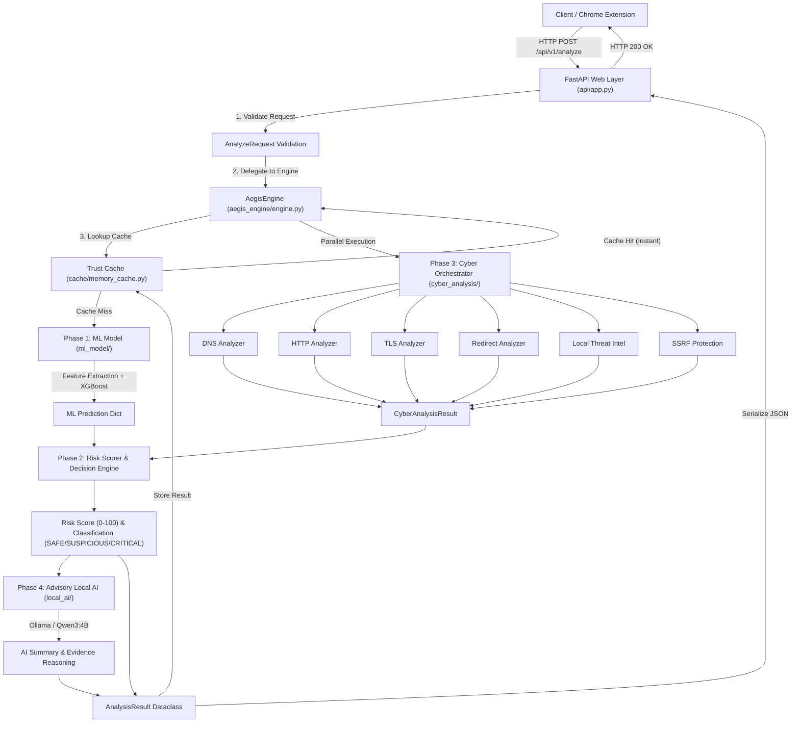

# AEGIS Backend — System Architecture & Component Output Specifications

This document provides a detailed breakdown of how each subsystem in the AEGIS backend operates, how data flows through the pipeline, and the exact data schema / format produced by each component.

---

## 🏗 Overall System Architecture & Data Flow



---

## 🧩 Component Breakdown & Output Specifications

---

### 1. ML Model & Feature Extraction (`ml_model/`)

#### **How It Works**
1. **URL Normalization (`feature_extractor.normalize_url`)**: Cleans input URLs, converts hostnames to lowercase, strips redundant trailing slashes, and removes default ports (`:80`, `:443`).
2. **Feature Extraction (`feature_extractor.extract_features`)**: Computes **51 lexical and structural features** from the URL string, including:
   - URL length, domain length, path length
   - Shannon entropy of URL string
   - Ratio of digits, letters, and special characters
   - Count of subdomains, IP address hostname checks
   - Presence of sensitive phishing keywords (`login`, `verify`, `account`, `banking`, etc.)
   - Symbol frequencies (`@`, `-`, `?`, `=`, `%`, `//`)
3. **XGBoost Inference (`predictor.predict_url`)**: Loads pre-trained XGBoost V6 model (`phishguard_xgb_v6.joblib`) and outputs raw phishing probability. If probability $\ge 0.7125$, the URL is predicted as `phishing` (label = 1), otherwise `legitimate` (label = 0).

#### **Output Format (`dict`)**
```json
{
  "url": "https://example.com",
  "prediction": 0,
  "probability": 0.0452,
  "label": "legitimate",
  "model_version": "xgboost_v6"
}
```

---

### 2. In-Memory Trust Cache (`cache/`)

#### **How It Works**
- Thread-safe in-memory cache implementation ([`MemoryCache`](file:///d:/AEGIS/AEGIS-BACKEND/cache/memory_cache.py)) protected by Python's `threading.Lock()`.
- **Keying**: Canonical normalized URL string.
- **Eviction & Expiration**:
  - **TTL**: Configurable time-to-live (`AEGIS_CACHE_TTL_SECONDS`, default 3600s).
  - **Capacity**: LRU eviction when capacity exceeds max size (default 10,000 entries).
  - **Model-Version Invalidation**: Automatically invalidates cache items if active model version changes.

#### **Output Format (`Optional[dict]`)**
- On **Cache Hit**: Returns dict representation of `AnalysisResult` with `"cached": true`.
- On **Cache Miss**: Returns `None`.

---

### 3. Parallel Cybersecurity Analyzers (`cyber_analysis/`)

#### **How It Works**
The [`CyberOrchestrator`](file:///d:/AEGIS/AEGIS-BACKEND/cyber_analysis/orchestrator.py) executes 5 specialized defensive analyzers concurrently in a thread pool (`ThreadPoolExecutor`):

1. **DNS Analyzer (`dns/`)**: Performs socket resolution, checking A/AAAA records, direct IP hosts, and resolution failures.
2. **HTTP Analyzer (`http/`)**: Executes safe read-only GET requests, inspecting status code (200, 404, 500), server response headers, content type, and unencrypted `http://` schemes.
3. **TLS Analyzer (`tls/`)**: Connects over port 443, inspecting SSL/TLS certificates for expiration, self-signed certificates, and issuer validation.
4. **Redirect Analyzer (`redirects/`)**: Traces HTTP redirect chains (up to 5 redirects max), detecting HTTPS-to-HTTP security downgrades and redirect loops.
5. **Local Threat Intelligence (`threat_intel/`)**: Fast domain lookup against local allowlist (`config/allowlist.txt`) and blocklist (`config/blocklist.txt`).
6. **SSRF Protection (`ssrf.py`)**: Intercepts requests to restricted internal networks (IPv4 loopback `127.0.0.0/8`, private ranges `10.0.0.0/8`, `172.16.0.0/12`, `192.168.0.0/16`, AWS/cloud metadata IP `169.254.169.254`, and hostnames like `localhost`).

#### **Output Format (`CyberAnalysisResult.to_dict()`)**
```json
{
  "dns": {
    "available": true,
    "status": "success",
    "data": { "ips": ["93.184.216.34"], "hostname": "example.com" },
    "signals": [],
    "errors": []
  },
  "http": {
    "available": true,
    "status": "success",
    "data": { "status_code": 200, "final_url": "https://example.com/", "scheme": "https" },
    "signals": [],
    "errors": []
  },
  "tls": {
    "available": true,
    "status": "success",
    "data": { "issuer": "DigiCert", "days_to_expiry": 180, "expired": false },
    "signals": [],
    "errors": []
  },
  "redirects": {
    "available": true,
    "status": "success",
    "data": { "redirect_count": 0, "final_url": "https://example.com/" },
    "signals": [],
    "errors": []
  },
  "threat_intel": {
    "available": true,
    "status": "no_match",
    "data": {},
    "signals": [],
    "errors": []
  },
  "signals": [
    {
      "source": "http",
      "type": "plain_http",
      "severity": "LOW",
      "description": "Target URL uses unencrypted HTTP protocol",
      "data": { "scheme": "http" }
    }
  ],
  "total_time_ms": 45.2
}
```

---

### 4. Integrated Risk Scorer & Decision Engine (`aegis_engine/`)

#### **How It Works**
1. **Base Score Calculation**: Maps ML phishing probability (0.0 to 1.0) into a base numeric score (0 to 100).
2. **Security Signal Adjustments**:
   - **Blocklist Match**: Adds **+80** risk penalty.
   - **Allowlist Match**: Applies **-40** risk discount.
   - **Expired TLS Certificate**: Adds **+25** penalty.
   - **HTTPS -> HTTP Downgrade**: Adds **+30** penalty.
   - **SSRF Block**: Sets risk score to **100**.
3. **Score Clamping**: Ensures final `risk_score` is strictly bound between `0` and `100`.
4. **Classification**:
   - `risk_score < 30` $\rightarrow$ **`SAFE`**
   - `30 <= risk_score < 70` $\rightarrow$ **`SUSPICIOUS`**
   - `risk_score >= 70` $\rightarrow$ **`CRITICAL`**
5. **Reason Generation**: Compiles human-readable explanations summarizing all triggered security factors.

#### **Output Format**
- `risk_score`: `4` (`int` 0..100)
- `classification`: `"SAFE"` (`str` enum)
- `reasons`: `["Low phishing probability from the ML model."]` (`List[str]`)

---

### 5. Advisory Local AI Interpreter (`local_ai/`)

#### **How It Works**
- Integrates a privacy-preserving local LLM runtime via Ollama (`qwen3:4b-instruct`).
- Converts structured ML and cybersecurity evidence into a clean prompt context.
- **Advisory Architecture**: Evaluates evidence reasoning without altering the deterministic risk score or classification.
- **Failure Tolerance**: If local Ollama is offline or disabled, it returns `available: false` with status `"disabled"` or `"unavailable"` without crashing the response.

#### **Output Format (`AIAnalysisResult.to_dict()`)**
```json
{
  "available": true,
  "status": "success",
  "provider": "ollama",
  "model": "qwen3:4b-instruct",
  "summary": "Target domain shows low-risk characteristics with valid HTTPS encryption.",
  "risk_assessment": "The target domain matches legitimate operational profiles.",
  "key_findings": [
    "Low ML phishing probability (0.05)",
    "Valid SSL/TLS certificate active"
  ],
  "supporting_signals": ["ml_probability", "dns_resolution"],
  "conflicting_signals": [],
  "uncertainties": [],
  "latency_ms": 420.1
}
```

---

### 6. FastAPI Primary Analysis Endpoint (`api/routes/analysis.py`)

#### **How It Works**
1. Receives HTTP `POST /api/v1/analyze` request body.
2. Validates string non-emptiness and maximum length limit (8192 chars) via `AnalyzeRequest` (Pydantic).
3. Invokes `AegisEngine.analyze(url)`.
4. Validates output score bounds (0..100) and classification enum.
5. Returns serialized `AnalyzeResponse` JSON object with HTTP 200 OK.

#### **Final Output Format (`AnalyzeResponse`)**
```json
{
  "url": "https://example.com",
  "classification": "SAFE",
  "risk_score": 4,
  "reasons": [
    "Low phishing probability from the ML model."
  ],
  "signals": {
    "ml_probability": 0.05,
    "ml_prediction": 0,
    "ml_label": "legitimate",
    "cyber_analysis": {
      "dns": { "available": true, "status": "success", "data": { ... } },
      "http": { "available": true, "status": "success", "data": { ... } },
      "tls": { "available": true, "status": "success", "data": { ... } },
      "redirects": { "available": true, "status": "success", "data": { ... } },
      "threat_intel": { "available": true, "status": "no_match", "data": {} }
    }
  },
  "ai": {
    "available": true,
    "status": "success",
    "provider": "ollama",
    "model": "qwen3:4b-instruct",
    "summary": "Target domain shows low-risk characteristics with valid HTTPS encryption.",
    "risk_assessment": "The target domain matches legitimate operational profiles.",
    "key_findings": [
      "Low ML phishing probability (0.05)",
      "Valid SSL/TLS certificate active"
    ],
    "supporting_signals": ["ml_probability", "dns_resolution"],
    "conflicting_signals": [],
    "uncertainties": [],
    "latency_ms": 420.1
  },
  "model_version": "xgboost_v6",
  "cached": false,
  "analysis_time_ms": 115.4
}
```

---

## ⚡ Latency & Performance Breakdown

| Execution Path | Average Latency | Description |
| :--- | :--- | :--- |
| **Trust Cache Hit** | **< 6 ms** | Instant response retrieved from in-memory cache. |
| **ML Only Analysis** | **~25 ms** | Feature extraction (51 features) + XGBoost prediction. |
| **ML + Cyber Analysis** | **~65 ms** | Parallel DNS, HTTP, TLS, Redirect, Threat Intel queries. |
| **Full Pipeline (+ Local AI)** | **~400–1200 ms** | Deep security pipeline + Ollama Qwen3:4B local inference. |
